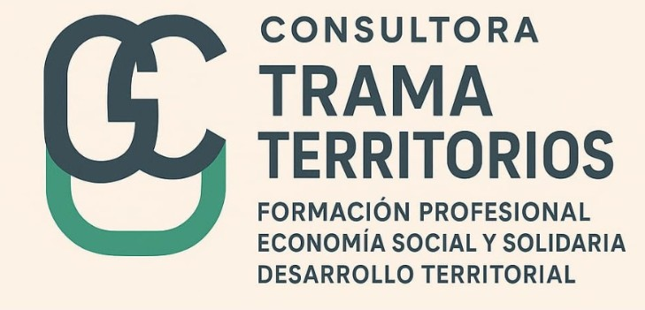
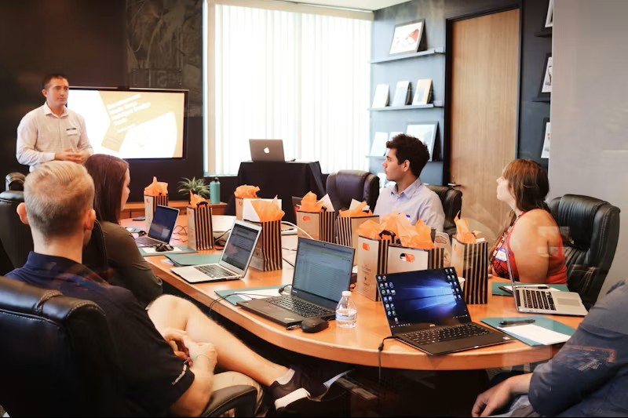

[index.html](https://github.com/user-attachments/files/24871052/index.html)
<!DOCTYPE html>
<html lang="es">
<head>
    <meta charset="UTF-8">
    <meta name="viewport" content="width=device-width, initial-scale=1.0">
    <title>Consultora Trama Territorios | Economía Solidaria y Oficios</title>
    
    <link href="https://cdnjs.cloudflare.com/ajax/libs/font-awesome/6.0.0/css/all.min.css" rel="stylesheet">
    
</head>
<body class="bg-slate-50 text-slate-800">

    <!-- Navegación -->
    <nav class="bg-white shadow-md sticky top-0 z-50">
        

            

                

                    <!-- Ruta local a la carpeta img para el logo -->
                    
                

                

                    

                        <a href="#inicio" class="text-blue-900 hover:text-blue-600 px-3 py-2 transition">Inicio</a>
                        <a href="#servicios" class="text-slate-600 hover:text-blue-600 px-3 py-2 transition">Servicios</a>
                        <a href="#nosotros" class="text-slate-600 hover:text-blue-600 px-3 py-2 transition">Nosotros</a>
                        <a href="#acciones" class="text-slate-600 hover:text-blue-600 px-3 py-2 transition">Novedades</a>
                        <a href="#contacto" class="bg-blue-600 text-white px-5 py-2 rounded-full hover:bg-blue-700 transition">Contactanos</a>
                    

                

                

                    <button id="mobile-menu-button" class="text-slate-600 hover:text-blue-600 focus:outline-none">
                        <i class="fa-solid fa-bars text-2xl"></i>
                    </button>
                

            

        

        <!-- Menú Móvil -->
        

            <a href="#inicio" class="block text-slate-600 py-2">Inicio</a>
            <a href="#servicios" class="block text-slate-600 py-2">Servicios</a>
            <a href="#nosotros" class="block text-slate-600 py-2">Nosotros</a>
            <a href="#acciones" class="block text-slate-600 py-2">Novedades</a>
            <a href="#contacto" class="block text-blue-600 font-bold py-2">Contacto</a>
        

    </nav>

    <!-- Hero Section -->
    <section id="inicio" class="hero-gradient min-h-[85vh] flex items-center text-white px-4 py-10">
        

            <h1 class="text-4xl md:text-6xl font-bold mb-6 leading-tight">
                Enseñamos a generar proyectos socioproductivos con anclaje en el aprendizaje de oficios y la economía solidaria
            </h1>
            

                Consultoría experta en desarrollo territorial para América Latina.
            

            

                <a href="https://wa.me/5492954316211?text=Hola,%20me%20encantar%C3%ADa%20recibir%20mas%20asesoramiento%20sobre%20Trama%20Territorios!%20Muchas%20Gracias." target="_blank" class="bg-green-600 hover:bg-green-700 text-white px-6 py-4 rounded-full font-bold text-lg transition flex items-center justify-center gap-2">
                    <i class="fa-brands fa-whatsapp"></i> WhatsApp
                </a>
                <a href="https://www.instagram.com/trama_territorios/" target="_blank" class="bg-gradient-to-r from-pink-500 via-red-500 to-yellow-500 hover:from-pink-600 hover:via-red-600 hover:to-yellow-600 text-white px-6 py-4 rounded-full font-bold text-lg transition flex items-center justify-center gap-2">
                    <i class="fa-brands fa-instagram"></i> Instagram
                </a>
                <a href="https://www.linkedin.com/in/gladys-cruse%C3%B1o-b41779337/" target="_blank" class="bg-blue-700 hover:bg-blue-800 text-white px-6 py-4 rounded-full font-bold text-lg transition flex items-center justify-center gap-2">
                    <i class="fa-brands fa-linkedin"></i> LinkedIn
                </a>
            

        

    </section>

    <!-- Servicios -->
    <section id="servicios" class="py-20 px-4">
        

            

                <h2 class="text-3xl md:text-4xl font-bold text-blue-900 mb-4">Nuestros Servicios</h2>
                

                
Soluciones integrales diseñadas para potenciar el desarrollo local y la economía social.

            

            

                <!-- Servicio 1 -->
                

                    

                        <i class="fa-solid fa-tools"></i>
                    

                    <h3 class="text-xl font-bold mb-3 text-blue-900">Enseñanza de oficios con base territorial</h3>
                    
Formación técnica adaptada a las necesidades reales de cada comunidad, impulsando la inserción laboral genuina.

                

                <!-- Servicio 2 -->
                

                    

                        <i class="fa-solid fa-city"></i>
                    

                    <h3 class="text-xl font-bold mb-3 text-blue-900">Asesoramiento Institucional</h3>
                    
Apoyo a Municipios y organizaciones intermedias interesadas en incorporar modelos de economía solidaria en su gestión.

                

                <!-- Servicio 3 -->
                

                    

                        <i class="fa-solid fa-chart-line"></i>
                    

                    <h3 class="text-xl font-bold mb-3 text-blue-900">Observatorios Sociales</h3>
                    
Creación y sostenimiento

                    
Implementación de herramientas de diagnóstico y seguimiento para entender la realidad social de cada territorio.

                

                <!-- Servicio 4 -->
                

                    

                        <i class="fa-solid fa-user-graduate"></i>
                    

                    <h3 class="text-xl font-bold mb-3 text-blue-900">Tutorías Especializadas</h3>
                    
Acompañamiento personalizado a estudiantes de nivel superior en carreras afines al desarrollo social.

                

                <!-- Servicio 5 -->
                

                    

                        <i class="fa-solid fa-book-open"></i>
                    

                    <h3 class="text-xl font-bold mb-3 text-blue-900">Producción de Obras</h3>
                    
Edición y publicación de libros y material técnico sobre prospectiva y desarrollo territorial.

                

            

        

    </section>

    <!-- Por qué nosotros -->
    <section id="nosotros" class="py-20 bg-blue-900 text-white px-4">
        

            

                <!-- NUEVO: Imagen de Gladys en formato circular -->
                

                Nuestra Dirección
                <h2 class="text-3xl md:text-5xl font-bold mb-6">Gladys Cruseño</h2>
                <h3 class="text-xl text-blue-200 mb-6 font-semibold">Experta en Desarrollo Territorial y Economía Social</h3>
                

                    "Nuestra fortaleza reside en el conocimiento profundo del trabajo en Territorio. Con más de 30 años de experiencia, sabemos desde dónde hablamos y proponemos. Somos expertos en prospectiva con un enfoque humano y solidario."
                

                
                

                    <a href="https://www.linkedin.com/in/gladys-cruse%C3%B1o-b41779337/" target="_blank" class="inline-flex items-center gap-2 text-white border border-white/30 hover:bg-white/10 px-6 py-3 rounded-full transition">
                        <i class="fa-brands fa-linkedin text-xl"></i> Ver Trayectoria Profesional
                    </a>
                

                

                    

                        30+
                        Años de experiencia territorial
                    

                    

                        LATAM
                        Presencia online regional
                    

                

            

            

                

                    <h4 class="font-bold text-xl mb-2 flex items-center gap-3">
                        <i class="fa-solid fa-check-circle text-blue-400"></i> Trato Personalizado
                    </h4>
                    
Te escuchamos y trabajamos con vos mano a mano, adaptándonos a tu realidad local.

                

                

                    <h4 class="font-bold text-xl mb-2 flex items-center gap-3">
                        <i class="fa-solid fa-check-circle text-blue-400"></i> Inversión Módica
                    </h4>
                    
Al ser parte de la economía social, nuestros servicios son accesibles para comunas y organizaciones.

                

            

        

    </section>

    <!-- Sección Acciones (Blog/Noticias) -->
    <section id="acciones" class="py-20 px-4">
        

            

                

                    <!-- Cambio de título para reflejar "Novedades" -->
                    <h2 class="text-3xl md:text-4xl font-bold text-blue-900 mb-4">Novedades y Acciones Recientes</h2>
                    

                

                <!-- Botón destacado a Instagram -->
                <a href="https://www.instagram.com/trama_territorios/" target="_blank" class="group flex items-center gap-2 bg-gradient-to-r from-pink-500 via-red-500 to-yellow-500 text-white px-6 py-3 rounded-full font-bold shadow-md hover:shadow-lg transition">
                    <i class="fa-brands fa-instagram text-xl"></i> 
                    Ver todas las novedades en Instagram
                    <i class="fa-solid fa-arrow-right group-hover:translate-x-1 transition"></i>
                </a>
            

            
            

                <!-- Noticia 1: Gestión de Proyectos -->
                

                    

                        <!-- Ruta local a la carpeta img -->
                        
                    

                    

                        Capacitación
                        <h3 class="text-xl font-bold my-2 text-blue-900">Gestión de Proyectos Socioproductivos</h3>
                        
Formación especializada en oficios (textil, gestión) con herramientas concretas para el desarrollo emprendedor.

                        <a href="https://wa.me/5492954316211" class="text-blue-600 font-bold text-sm">Consultar próxima fecha</a>
                    

                

                <!-- Noticia 2: Asesoramiento -->
                

                    

                        <!-- Ruta local a la carpeta img -->
                        
                    

                    

                        Municipios
                        <h3 class="text-xl font-bold my-2 text-blue-900">Acompañamiento a la Gestión Local</h3>
                        
Asesoramiento integral a comunas para el diseño e implementación de políticas de economía social.

                        <a href="https://wa.me/5492954316211" class="text-blue-600 font-bold text-sm">Solicitar reunión</a>
                    

                

                <!-- Noticia 3: Publicaciones -->
                

                    

                        <!-- Ruta local a la carpeta img -->
                        
                    

                    

                        Publicaciones
                        <h3 class="text-xl font-bold my-2 text-blue-900">Prospectiva y Desarrollo Territorial</h3>
                        
Nuestras últimas producciones editoriales y papers disponibles para estudiantes y profesionales del sector.

                        <a href="https://wa.me/5492954316211" class="text-blue-600 font-bold text-sm">Conseguir material</a>
                    

                

            

        

    </section>

    <!-- Footer / Contacto -->
    <footer id="contacto" class="bg-slate-900 text-white pt-20 pb-10 px-4">
        

            

                

                    <!-- Ruta local a la carpeta img para el logo en footer -->
                    
                    

                        Transformando el territorio a través de la educación y la economía social.
                    

                    

                        

                            <i class="fa-solid fa-phone text-blue-400 w-5"></i>
                            +54 9 2954 31-6211
                        

                        

                            <i class="fa-solid fa-envelope text-blue-400 w-5"></i>
                            <!-- Correo actualizado -->
                            formacionprofesional354@gmail.com
                        

                    

                

                

                    <h3 class="text-xl font-bold mb-6">Contactanos directamente</h3>
                    <a href="https://wa.me/5492954316211?text=Hola,%20me%20encantar%C3%ADa%20recibir%20mas%20asesoramiento%20sobre%20Trama%20Territorios!%20Muchas%20Gracias." target="_blank" class="inline-block bg-green-600 hover:bg-green-700 text-white font-bold py-4 px-10 rounded-xl transition w-full text-center">
                        <i class="fa-brands fa-whatsapp mr-2"></i> Enviar WhatsApp
                    </a>
                

            

            
            

                

                    <a href="https://www.instagram.com/trama_territorios/" target="_blank" class="text-slate-500 hover:text-pink-500 transition"><i class="fa-brands fa-instagram"></i></a>
                    <a href="https://www.linkedin.com/in/gladys-cruse%C3%B1o-b41779337/" target="_blank" class="text-slate-500 hover:text-blue-500 transition"><i class="fa-brands fa-linkedin"></i></a>
                

                
© 2024 Consultora Trama Territorios.

            

        

    </footer>

    <!-- WhatsApp Floating Button -->
    <a href="https://wa.me/5492954316211?text=Hola,%20me%20encantar%C3%ADa%20recibir%20mas%20asesoramiento%20sobre%20Trama%20Territorios!%20Muchas%20Gracias." class="whatsapp-float" target="_blank" title="Contactanos por WhatsApp">
        <i class="fa-brands fa-whatsapp"></i>
    </a>

    
</body>
</html>
